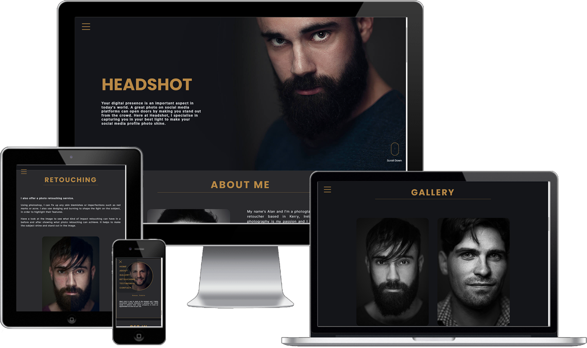
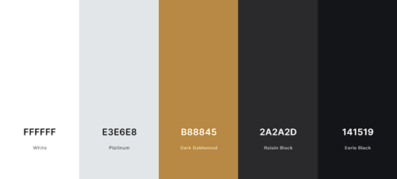
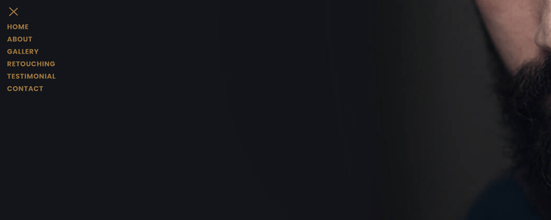
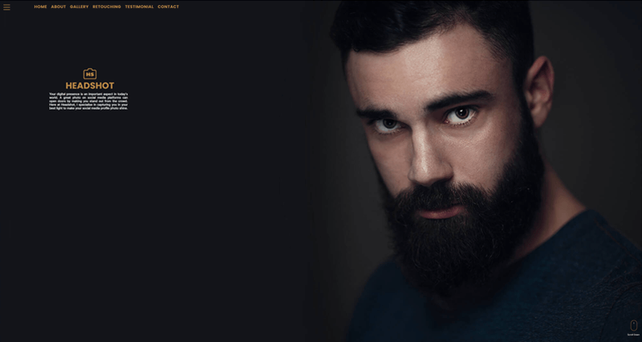
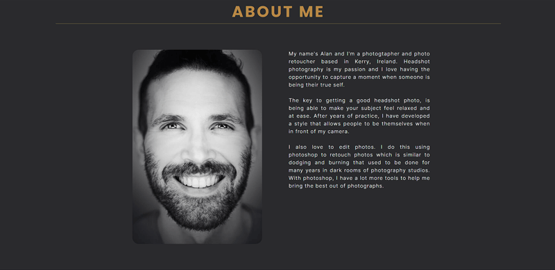
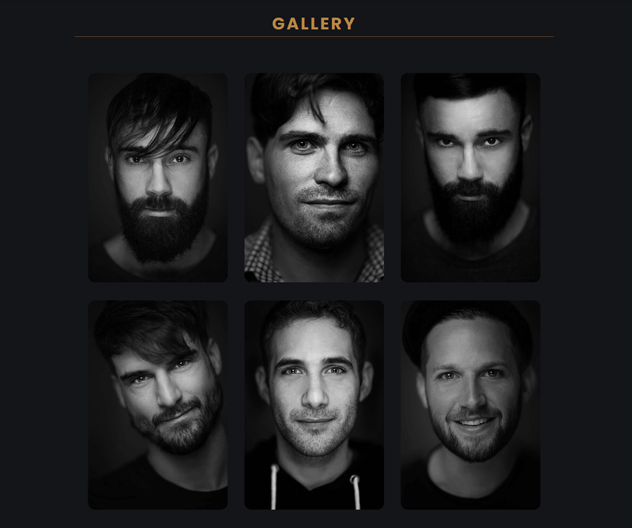
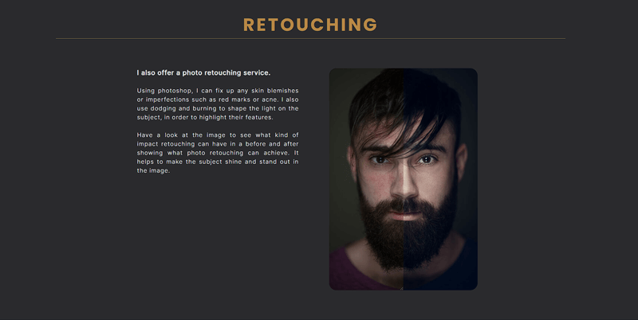
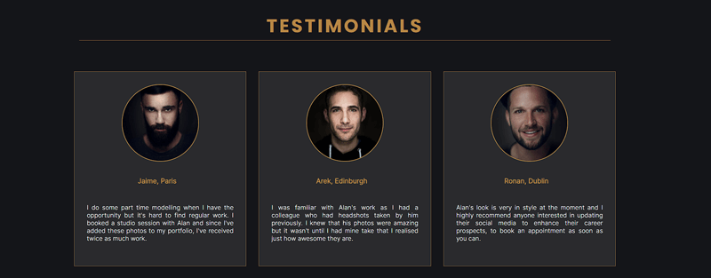
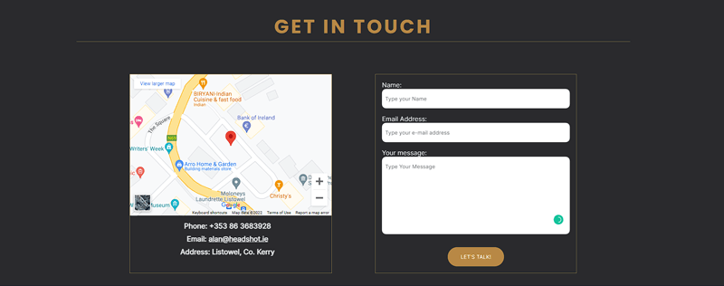

# HeadShot Photography Ireland

## Portfolio 1 project as part of the Diploma in Full Stack Software Development by Code Institute.
Headshot Photography Ireland is a website designed for a headshot phototography studio based in Kerry, Ireland.

# Contents

* [Objective](<#objective>)
* [User Experience UX](<#user-experience-ux>)
    * [Target Audience](<#target-audience>)
    * [User Stories](<#user-stories>)
* [Design](<#design>)
    * [Site Structure](<#site-structure>)
    * [Colour Scheme](<#colour-scheme>)
    * [Typography](<#typography>)
    * [Imagery](<#imagery>)
    * [Wireframes](<#wireframes>)
* [Features](<#features>)
    * [Navigation Menu](<#navigation-menu>)
    * [Home Page](<#home-page>)
    * [About Page](<#about-page>)
    * [Login Page](<#login-page>)
    * [Register Page](<#register-page>)
    * [Profile Page](<#profile-page>)
    * [Contact Page](<#contact-page>)
    * [Footer](<#footer>)
    * [Create Events](<#create-events>)
    * [Friend System](<#friend-system>)
* [Future Features](<#future-features>)
* [Technologies Used](<#technologies-used>)
* [Testing](<#testing>)
    * [Bugs](<#bugs>)
    * [Validator Testing](<#validator-testing>)
    * [Lighthouse Testing](<#lighthouse-testing>)
    * [Unfixed Bugs](<#unfixed-bugs>)
* [Deployment](<#deployment>)  
* [Credits](<#credits>)
    * [Developer Team](<#developer-team>)

# Objective:

To design a clean, intuitive and fully responsive website with a style to match the photographer's aesthetic.

The three main objectives are:

* ## Use only HTML and CSS - no JS or bootstrap
    There were features that could have been easily implemented with JS but as this project was to test HTML and CSS skills (and will only be granded on these), I decided to try and recreate features in CSS and HTML only. I also decided to stay away from using bootstrap to create the site.
* ## Inform
    The user is able to tell what the website is about within the first few seconds of viewing the website
* ## Contact
    The user is able to contact the photographer about questions they may have or to book a photography session.

[Back to top](<#contents>)

# User Experience (UX):

## Target Audience

* Users that are looking for a professional headshot photo for their modelling portfolio. 
* Users that are looking for a professional headshot photo for their social media profiles.
* Users that are looking for a professional retoucher for their profile photos.

## User Stories

### Visitor Goals

* Easily navigate the website.
* Understand what the website is about.
* Understand what services are being offered.
* Easily make contact with the photographer.

[Back to top](<#contents>)

# Design Choices

## Site Structure

Headshot photography consists of a single page website that the user can navigate between via the navigation bar from the main menu, or the hamburger menu from everywhere. The main page is the default loading page. There are six navigation links, one for each section. They are: Home, About, Gallery, Retouch, Testimonial and Contact.

## Colour Scheme

The colour scheme used for this project was chosen from using a dropper tool in photoshop on one of the headshot images to maintain a similar aesthetic between  the website and headshot images. [Coolor](https://coolors.co/ffffff-e3e6e8-b88845-2a2a2d-141519).

* White `#FFFFFF`
* Platinum `#E3E6E8`
* Dark Goldenrod `#B88845`
* Raisin Black `2A2A2D`
* Eerie Black `#141519`

## Typography

I chose the font **Poppins** for the headings and the font **Inter**  for all other text content in the website as I liked the clean look of both fonts.
The fonts were sourced from [Google Fonts](https://fonts.google.com/).

## Imagery

All photos were taken by me, the photographer and the logo was designed by me in photoshop. Readme images were screenshot from mentioned sites and wireframes were created in photoshop.

## Wireframes

 Wireframes 

[Back to top](<#contents>)

# Features

Headshot is designed as a one page structured website, making it very clean and logically laid out so the user clearly knows what the site is about and what services they can avail of.

The language is easy to understand and the navigation is intuitive with a consistent color scheme that adds to the style of the photographers photos.

This is a fully responsive website. 

## Navigation Menu

When viewing the main page on a desktop, there is a navbar present which has 6 links to the sections of the website.

When viewing the main page on a mobile device, the navbar disappears.

There is a hamburger menu showing at all times on all devices at the top left of the screen. This contains 6 links to the different sections of the website. The hamburger menu was modified from code created by [Álvaro](https://codepen.io/alvarotrigo/pen/wvrzPWL)

## Main Section 

The Main section is accessible from both the Navbar and the hamburger menu from the HOME link.

The Main Section is the landing page of the website and the first part that the user will see.

There is a large background image with the logo, name and brief description of what the site is about overlayed.

There is a scroll down animation hint on the bottom left of the main screen to entice the user to scroll down through the site. The scroll down animation was modified from code created by [Deepak K Vijayan](https://codepen.io/2xsamurai/pen/WwmjKQ)

## About Section

The About section is accessible from both the Navbar and the hamburger menu from the ABOUT link.

This section contains a headshot photo of the photographer and a description of them so the user can get to know them and understand their style of photography.

## Gallery Section

The Gallery section is accessible from both the Navbar and the hamburger menu from the Gallery link.

This section contains 6 images that have a hover animation.

There is also a lightbox implemented with CSS that appears when the images are clicked to give a higher resolution image to the user. The gallery Lightbox was modified from code created by [Kevin Powell](https://codepen.io/kevinpowell/pen/LgMLao)

## Retouch Section

This section has a explanation of what retouching is and also a before/after slider created in CSS. Before/After slider was modified from code created by [Lea Varou](https://lea.verou.me/2014/07/image-comparison-slider-with-pure-css/) 

## Testimonial Section

This secton contains three testimonials from previous clients of Headshot Photography.

## Contact Section

The contact section has a google map, contact information, and a contact form in which the user can contact the photographer with a message.

The form currently submits to the Code Institute form dump.

## Footer

The footer contains the social media icons that link to the main sites as headshot does not have profiles on social media.

[Back to top](<#contents>)

# Future Features

* modal confirmation pop-up on form submission
* add a calender with slots for booking studio time

[Back to top](<#contents>)

# Technologies Used

* HTML5 - Delivers the structure and content for the site.
* CSS3 - Provides the styling for the site
* Google Chrome DevTools - Used to debug
* Tinyjpg - Used to reduce image size
* Git - Version control
* GitHub - Used to host website

# Testing 

I have spent many many hours testing this site and had family and friends go through it for me on different devices. This led to many issues being identified.

## Validator Testing 

- HTML
  - No errors were returned when passing through the official [W3C validator](https://validator.w3.org/)
- CSS
  - No errors were found when passing through the official [(Jigsaw) validator](https://jigsaw.w3.org/css-validator/)

## Lighthouse Testing

The website was also put through Lighthouse testing and passed all tests with a green result.

## Bugs

* The main issues involved resonsiveness on mobile devices. Due to the many different sizes of devices, when I though I had resolved the issue I had other friends tell me text was overflowing on their device. The banner on the main section was the most frequest culprit.
To combat the issue with the banner, I had to change it's absolute location depending on the screen size. I also had the font size reduce which helped and because I had used rem instead of px for my dimensions, this made text responsiveness much easier to change.

* The google map also presented an issue with responsiveness. It doesn't have any responsiveness as the dimensions are set in the iframe. For this reason. I created two divs and have one set to shown and the other set to hidden. On larger screen sizes, the div containing the larger map is shown and the smaller map div is hidden. On smaller screen sizes, the div with the small map is shown and the larger one is hidden. This solved the issue.

* The before/after slider also does not have responsiveness so I had to use a media query to set the images width manually in order for it to fit in smaller devices.

* On lightbox close, # made it jump to main section and #gallery made it jump back to the start of the gallery section. Using #! instead, resolved this bug.

* The gallery lightbox was not responsive on screen width changes, changed width from auto to 80vw and resolved bug.

* I had issues with hover transforms easing in but snapping out even though ease-in-out was included.  I added transition to the non hover class and it resolved the bug.

* When using nav links, it snapped to sections instead of scrolling, I resolved this by adding a scroll-behavior: smooth; to the css and resolved this bug. 

As mentioned above, the website has been tested on numerous laptops, desktops and mobile devices and the look is clean and functional on all of them that have been tested.

## Unfixed Bugs

Due to the fact that I chose to use only HTML and CSS as that is what this project is being graded on, there are better ways to implement features such as the slider in the retouch section and the lightbox in the gallery section. These are not necessarly bugs, more so, opportunities for improvement using JS.

# Deployment

Deployment was done using GitHub pages. The steps to deploy are as follows: 

  - Open GitHub repository, 
  - Navigate to the Settings tab
  - Click pages link in the left column
  - In the source section drop-down menu, select the Main Branch
  - Once the Main Branch has been selected, the page will be automatically refreshed with a detailed ribbon display to indicate the successful deployment. 

The live link can be found here - https://sdalsosa.github.io/Headshot-Photography/

[Back to top](<#contents>)

# Credits

All images were taken and edited by me.

As I wanted to only utilise HTML and CSS, I needed to find ways to implement certain features without using JS. Here are the sources for the code I used.

Hamburger menu was modified from code created by [Álvaro](https://codepen.io/alvarotrigo/pen/wvrzPWL)

Scroll Down animation was modified from code created by [Deepak K Vijayan](https://codepen.io/2xsamurai/pen/WwmjKQ)

Gallery Lightbox was modified from code created by [Kevin Powell](https://codepen.io/kevinpowell/pen/LgMLao)

Before/After slider was modified from code created by [Lea Varou](https://lea.verou.me/2014/07/image-comparison-slider-with-pure-css/)

## Developer

* Alan Egan - Junior Software Developer at Code Institue

[Back to top](<#contents>)

